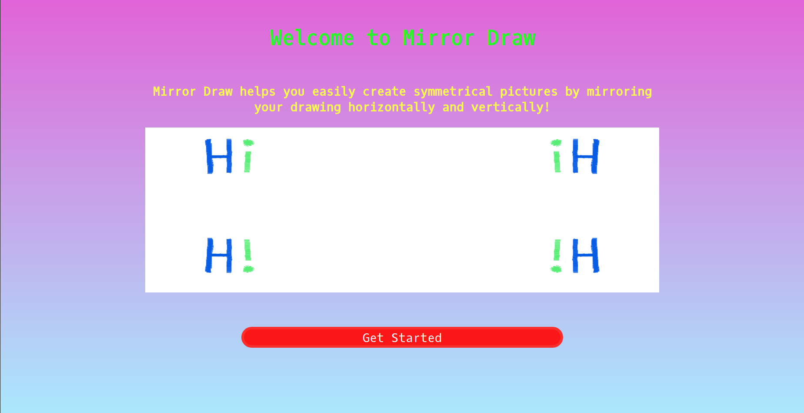
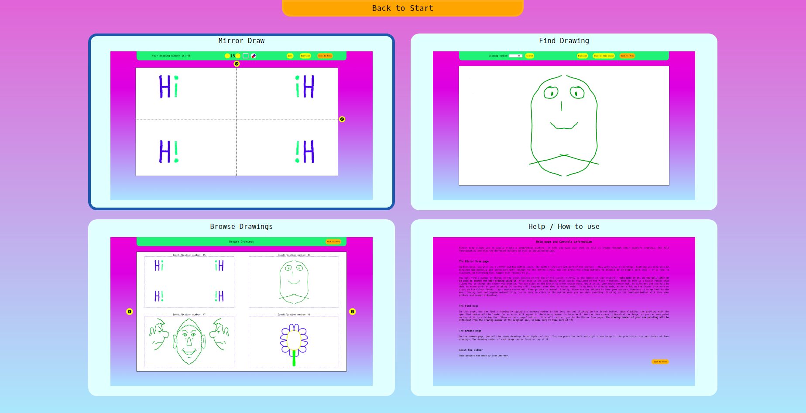
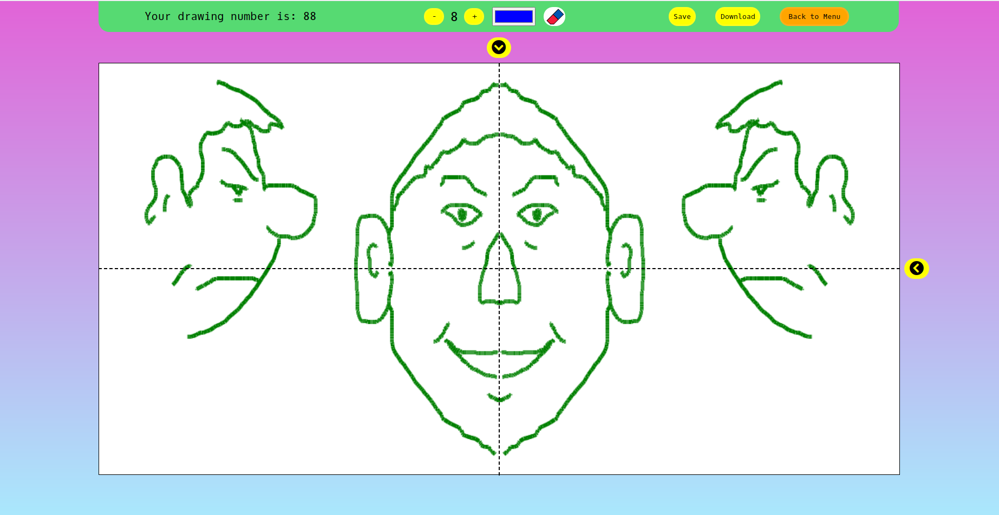
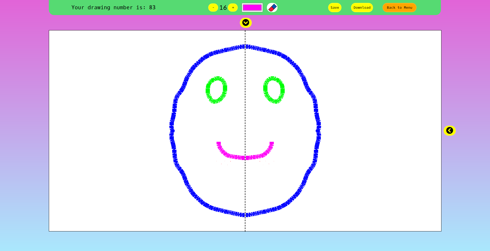
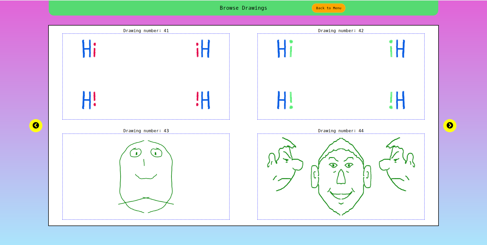

# About Mirror Draw

Mirror Draw allows you to easily create a symmetrical picture. It lets you save your work as well as browse through other people's drawings.

 

# Main Screen
On the main screen, you can choose to draw a new picture or browse the drawings of others.

 

# Drawing

On this page, you will see a canvas and two dotted lines. The dotted lines are not part of the picture - they only serve as markings. Anything you draw will be mirrored horizontally and vertically with respect to the dotted lines. You can press the arrow buttons to disable or re-enable each line - if a line is disabled, no mirroring will happen with respect to it.

In the green toolbox at the top, you can find the ID of your drawing (and come back to it later), change the size of the drawing line and its colour, and the eraser tool.

 

# Browsing
You can browse others' drawings, download them, and even draw on top of (a copy of) their prictures!

 

# About the project

Mirror Draw was created with Django and JavaScript by Ivan Andreev.
